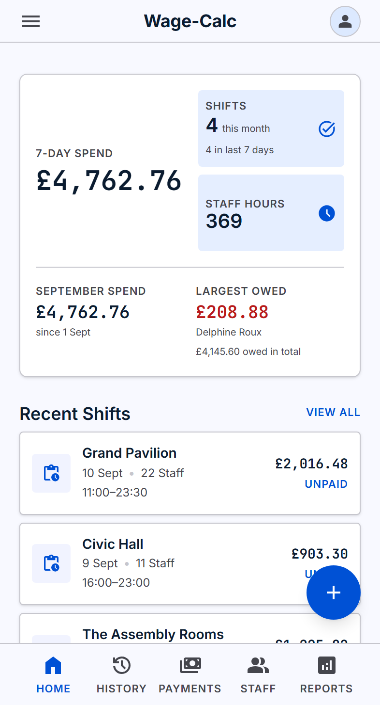
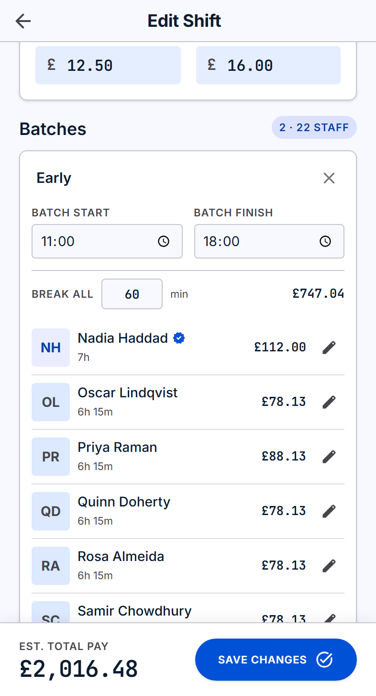
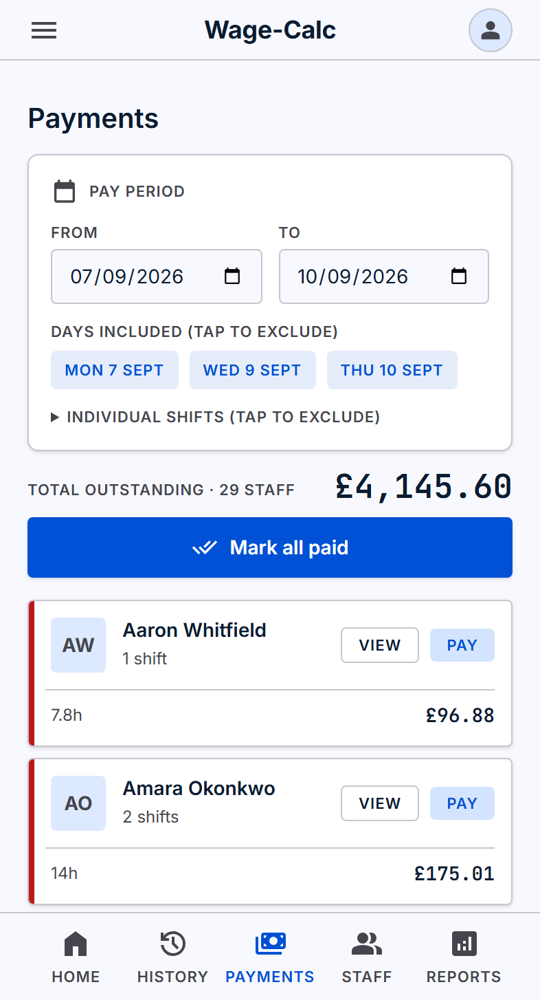
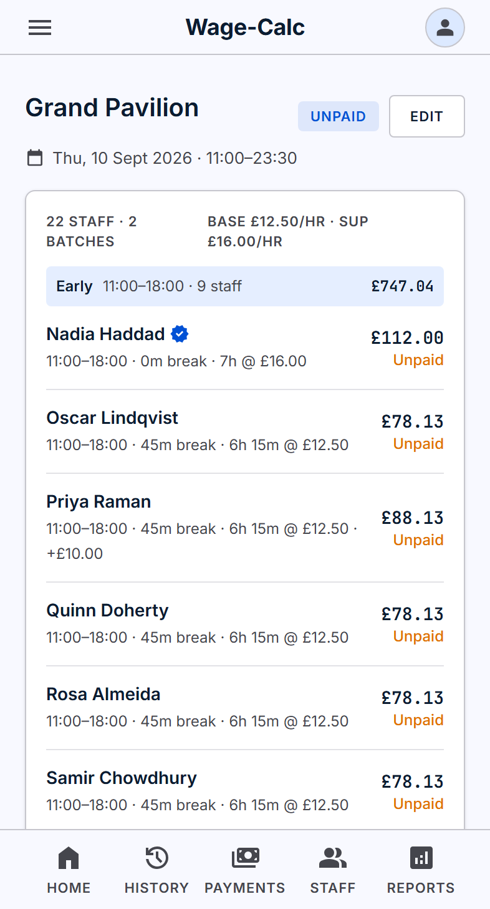
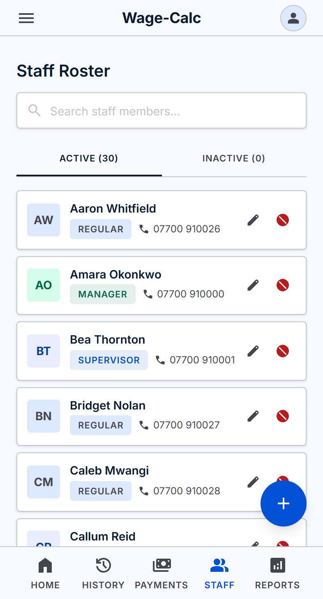

<div align="center">

# Wage-Calc

**Payroll for event staffing, built for one accountant who was doing it in their head.**

A phone-first PWA that turns a 46-person shift into a few taps and an exact
payslip figure — in production, used weekly for real wages.

[](https://github.com/Ilyasin001/Wage-Calc/actions/workflows/ci.yml)


[](LICENSE)





<sub>Screenshots use fictional demo data — see
<a href="scripts/demo-seed.ts"><code>scripts/demo-seed.ts</code></a>.</sub>

</div>

---

## Status

**In production.** Deployed on Vercel + Neon and used weekly by the accountant
it was built for, an events staffing company running 3–4 functions a week
across four venues, with a roster of ~70 staff and shifts of up to 46 people.
Real wages are calculated and paid from it.

Actively maintained — features are still added in response to how it is
actually used. The batch feature below exists because the first version made
them enter 28 staff one at a time.

> **Live demo:** _not public._ The deployment holds one business's real payroll
> data, so there is no shared login. The screenshots above and the
> [sample PDF report](docs/sample-report.pdf) are generated from an equivalent
> demo dataset, and the app runs locally in about two minutes — see
> [Running it locally](#running-it-locally).

## Why it exists, and why it is single-tenant

An events staffing company pays casual staff per shift. Every week the
accountant worked out wages for dozens of people — start time, finish time,
unpaid break, a different rate for whoever supervised, occasional tips — and
did most of it mentally, then in a spreadsheet, and had to remember who had
already been paid.

The interesting constraint is that this is built for **exactly one person, at
exactly one company.** That was a deliberate choice, not a shortcut, and it
shaped the whole design:

- **No multi-tenancy, no organisations, no roles.** One account. Every query
  is simpler for it, and there is no tenant-scoping bug waiting to leak one
  company's payroll into another's.
- **Invariants live in the database, not the UI.** With one user there is no
  appetite for defensive complexity — but there is also nobody to catch a
  mistake. So "exactly one supervisor per shift" is a unique index, not a
  form validation.
- **The workflow is the spec.** Pay week runs Monday to Sunday because that is
  when they pay people. Breaks default to 60 minutes because that is the
  company's rule. Supervisors default to no break because they do not take one.

Building for a real user with real money also sets the bar for correctness:
a rounding error is not a failing test, it is someone underpaid.

## What it does

| | |
|---|---|
| **Batches** | A shift holds one or more batches — groups who share start and finish times. A 46-person function with an early set-up crew and a later service crew is two batches, not 46 sets of times. Individuals can still override their own hours |
| **Live totals** | Per-person and shift totals update as you type, computed by the same module the server uses to save them |
| **Payments** | Shows only staff who are *owed* money for the days you select, with per-person totals. Mark one person paid without touching the rest. Paid entries lock so nobody is paid twice |
| **PDF reports** | Per-shift breakdown grouped by batch, plus a per-staff summary for the pay run — [sample](docs/sample-report.pdf) |
| **Permanent record** | Every shift kept and searchable by date, venue or staff member. Every edit audit-logged in readable form |
| **Installs like an app** | A PWA — added to the home screen, used one-handed on site |

<div align="center">


</div>

## Engineering worth a look

A few decisions that are more interesting than the CRUD around them:

- **Money never touches a float.** Everything is integer pence with half-up
  rounding done in integer arithmetic. Pounds exist only at the display and
  input boundaries.
- **One supervisor per shift is a database constraint.** `isSupervisor` is
  `true` or `NULL`, never `false`, so a partial unique index lets any number
  of crew coexist while physically rejecting a second supervisor.
- **Overnight shifts and BST.** Shifts cross midnight and the clocks change
  twice a year. Entering a bare `02:00` resolves to the right calendar day by
  picking the candidate nearest the shift start; pay follows elapsed real
  time, so 23:00→05:00 across the spring change pays six hours, not seven.
- **Settled money is immovable.** Once an entry is marked paid its wage fields
  lock, the shift cannot be deleted, and unlocking is a deliberate,
  audit-logged revert.
- **One codebase, two databases.** SQLite locally, Postgres in production,
  selected from `DATABASE_URL` — adapter, schema *and* migration history — so
  deploying never means editing a provider by hand. A test fails if the two
  schemas drift apart.

Full detail, with diagrams: **[docs/ARCHITECTURE.md](docs/ARCHITECTURE.md)**.

## Stack

**Next.js 16** (App Router, Server Actions) · **TypeScript** (strict) ·
**Tailwind CSS** · **Prisma** with SQLite / Postgres driver adapters ·
**Auth.js** credentials · **Zod** · **@react-pdf/renderer** ·
**Vitest** + **Playwright** · deployed on **Vercel** + **Neon**.

## Running it locally

```bash
git clone https://github.com/Ilyasin001/Wage-Calc.git
cd Wage-Calc
npm install

cp .env.example .env          # then set AUTH_SECRET — npm run gen:secret
npx prisma migrate dev        # creates dev.db
npm run seed                  # prints the login it creates — save it
npm run dev                   # http://localhost:3000
```

Open it at a phone viewport; it is designed for a 390px screen first.

To browse a populated app rather than an empty one, load the same fictional
dataset the screenshots use:

```bash
DATABASE_URL="file:./demo.db" npx prisma db push --url "file:./demo.db"
DATABASE_URL="file:./demo.db" npx tsx scripts/demo-seed.ts
DATABASE_URL="file:./demo.db" npm run dev      # demo@wagecalc.local / demo-password
```

### Commands

| Command | What it does |
|---|---|
| `npm run dev` | Dev server |
| `npm test` | Unit + integration tests |
| `npx playwright test` | E2E suite (own database, own port) |
| `npm run typecheck` / `npm run lint` | Static checks |
| `npm run verify:db` | Read-only: what tables and rows the current `DATABASE_URL` holds |
| `npm run seed` | Create or reset the account |
| `npm run build` | Production build |

Deployment, including moving live data to Neon:
**[docs/DEPLOYMENT.md](docs/DEPLOYMENT.md)**.

## Testing

91 unit and integration tests, 14 end-to-end tests, all run in CI on every
push along with typecheck, lint and a production build.

The wage engine is tested exhaustively rather than representatively —
half-penny rounding, the 15-minute grid, overnight spans, DST transitions,
breaks longer than the shift. The database invariants have tests that try to
violate them and assert the database says no. The E2E suite drives the real
UI at a phone viewport through the flows that matter: creating a two-batch
shift, the double-payment guard, paid-entry locking, PDF generation.

## Project structure

```
src/
├── app/                 # routes — dashboard, shifts, payments, history, staff, settings
│   └── api/reports/     # PDF generation endpoint
├── components/          # shared UI: shift editor, staff picker, cards, nav
├── lib/
│   ├── wage.ts          # the wage engine — pure, no I/O, used by client and server
│   ├── time.ts          # Europe/London ↔ UTC, overnight and pay-week logic
│   ├── shift-view.ts    # turns rows into per-batch display data
│   ├── report-*.ts      # report data + PDF rendering
│   ├── actions/         # server actions: validated, session-checked, audited
│   └── *.test.ts        # unit + database-constraint tests
├── auth.ts, proxy.ts    # authentication and the route guard
prisma/
├── schema.prisma        # single source of truth (SQLite, development)
├── migrations/          # development migration history
└── production/          # generated Postgres schema + its migrations
scripts/                 # setup, data export/import, screenshots, verification
e2e/                     # Playwright suite
docs/                    # architecture, specification, deployment, screenshots
```

## Documentation

| Document | What is in it |
|---|---|
| [ARCHITECTURE.md](docs/ARCHITECTURE.md) | Domain model, request flow, money/time handling, testing strategy |
| [SPECIFICATION.md](docs/SPECIFICATION.md) | The full product spec — every decision, numbered, with the reasoning |
| [DEPLOYMENT.md](docs/DEPLOYMENT.md) | Deploying to Vercel + Neon, moving data, recovery |
| [IMPLEMENTATION_PLAN.md](docs/IMPLEMENTATION_PLAN.md) | The milestone plan the build followed |

The specification was written before the code and updated whenever a
requirement changed, with each amendment recorded against the decision it
supersedes. It is probably the most useful document here for understanding
how the project was approached.

## Contributing

This is a personal project built for a specific user, so it is not looking for
feature contributions — but bug reports and questions are welcome via
[issues](https://github.com/Ilyasin001/Wage-Calc/issues).

If you are poking at the code: `npm test` and `npx playwright test` should
both pass before and after any change, and CI enforces typecheck, lint and a
production build.

## Licence

[MIT](LICENSE).
