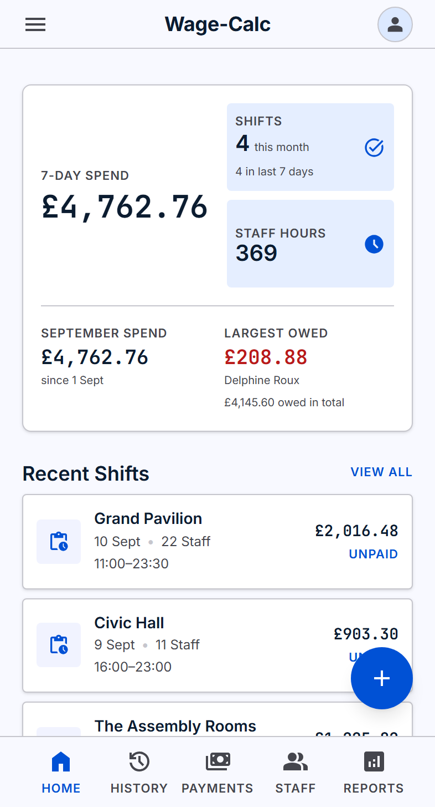
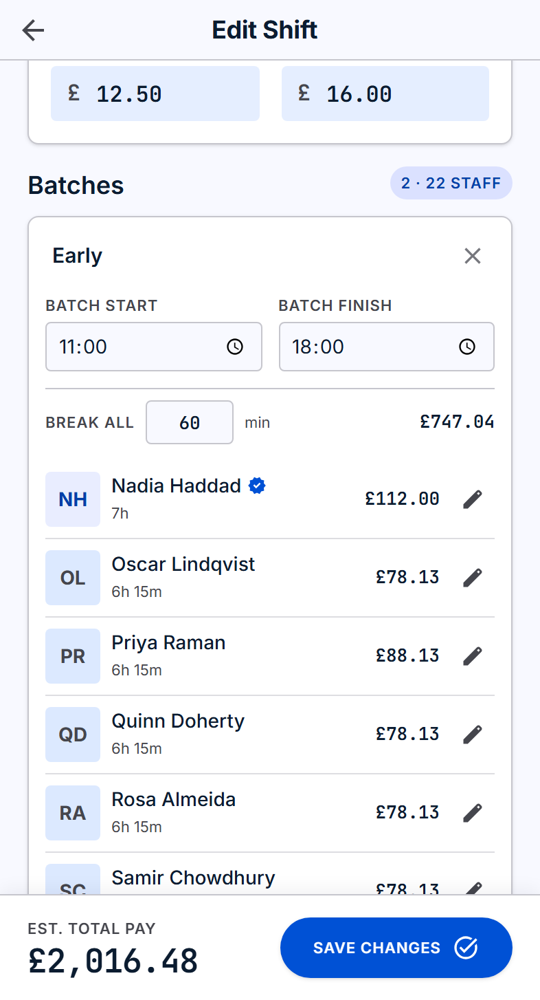
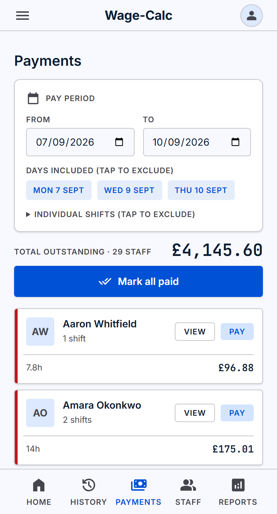

# Wage-Calc 🧮

[](https://github.com/Ilyasin001/Wage-Calc/actions/workflows/ci.yml)    
[](https://opensource.org/licenses/MIT)

**Payroll for event staffing, built for a single accountant managing payroll in their head.**

A phone-first PWA that streamlines the process of calculating wages for event staff. It simplifies managing shifts, calculating exact payslips, and maintaining payroll records, all within a production-ready, single-tenant application.

<div align="center">



</div>

<sub>Screenshots use fictional demo data — see <code>scripts/demo-seed.ts</code>.</sub>

--- 

## 🌟 Status

**Actively in production and maintained.** Deployed on Vercel + Neon, this application is used weekly by the accountant for whom it was originally built. It serves an events staffing company managing payroll for approximately 70 staff across multiple venues. Real wages are calculated and paid directly from the system.

## ✨ Why it exists, and why it is single-tenant

This application addresses the specific challenge of calculating wages for casual event staff, a process that was previously managed mentally and then via spreadsheets. The single-tenant design prioritizes simplicity and security, eliminating the complexities of multi-tenancy and reducing the risk of data leaks. Invariants are enforced at the database level, and the user workflow dictates the application's specification, ensuring correctness for real-world financial calculations.

## 🚀 What it does

| Feature | Description |
|---|---|
| **Batches** | Groups staff within a shift who share start and finish times, simplifying entry for large events. |
| **Live Totals** | Real-time calculation of per-person and shift totals as data is entered. |
| **Payments Management** | Displays only staff who are owed money, allowing individual payment marking. Paid entries are locked to prevent double payments. |
| **PDF Reports** | Generates per-shift and per-staff summaries for payroll runs. |
| **Permanent Record** | Stores all shifts with audit logging for every change, ensuring a complete history. |
| **PWA** | Installs like an app for easy, one-handed use on mobile devices. |

## 🛠️ Engineering Highlights

-   **Integer Arithmetic for Money:** All monetary calculations are done in integer pence to avoid floating-point errors, with half-up rounding. Pounds are only used at the display and input boundaries.
-   **Database Constraints for Invariants:** Critical rules like "exactly one supervisor per shift" are enforced by database constraints (partial unique indexes) rather than just UI validation.
-   **Robust Time Handling:** Accurately manages overnight shifts and Daylight Saving Time (BST) transitions, ensuring correct elapsed time calculation.
-   **Immutable Settled Data:** Once an entry is marked paid, its wage fields lock, preventing accidental modifications. Reverting requires a deliberate, logged action.
-   **Dual Database Support:** Seamlessly works with both SQLite (local development) and PostgreSQL (production) using Prisma driver adapters, ensuring schema consistency.

Full architectural details are available in [<code>docs/ARCHITECTURE.md</code>](docs/ARCHITECTURE.md).

## 📚 Stack

-   **Framework:** Next.js 16 (App Router, Server Actions)
-   **Language:** TypeScript (strict)
-   **Styling:** Tailwind CSS
-   **Database:** Prisma with SQLite / Postgres driver adapters
-   **Authentication:** Auth.js (Credentials provider)
-   **Validation:** Zod
-   **PDF Generation:** @react-pdf/renderer
-   **Testing:** Vitest + Playwright
-   **Deployment:** Vercel + Neon (PostgreSQL)

## 🚀 Running it Locally

```bash
git clone https://github.com/Ilyasin001/Wage-Calc.git
cd Wage-Calc
npm install

cp .env.example .env          # then set AUTH_SECRET — npm run gen:secret
npx prisma migrate dev        # creates dev.db
npm run seed                  # prints the login it creates — save it
npm run dev                   # http://localhost:3000
```

Access the app in a phone viewport; it's designed for a 390px screen first.

To populate the app with demo data (used for screenshots):

```bash
DATABASE_URL="file:./demo.db" npx prisma db push --url "file:./demo.db"
DATABASE_URL="file:./demo.db" npx tsx scripts/demo-seed.ts
DATABASE_URL="file:./demo.db" npm run dev      # demo@wagecalc.local / demo-password
```

### Commands

| Command | Description |
|---|---|
| `npm run dev` | Starts the development server. |
| `npm test` | Runs unit and integration tests. |
| `npx playwright test` | Executes the end-to-end test suite (uses its own database and port). |
| `npm run typecheck` / `npm run lint` | Performs static analysis checks. |
| `npm run verify:db` | Verifies the current database schema and row counts. |
| `npm run seed` | Creates or resets the application account. |
| `npm run build` | Creates a production build of the application. |

For deployment instructions, see [<code>docs/DEPLOYMENT.md</code>](docs/DEPLOYMENT.md).

## 🧪 Testing

-   **Unit & Integration:** 91 tests.
-   **End-to-End (E2E):** 14 tests covering critical flows, run in CI.

The testing strategy focuses on exhaustive testing of the wage engine, database invariants, and core UI flows. E2E tests simulate real user interactions on a phone viewport, ensuring core features like shift creation, payment processing, and PDF generation function correctly.

## 📁 Project Structure

```
src/
├── app/                 # Routes: dashboard, shifts, payments, history, staff, settings
│   └── api/reports/     # PDF generation endpoint
├── components/          # Shared UI components (shift editor, staff picker, cards, nav)
├── lib/
│   ├── wage.ts          # Wage calculation engine (pure, I/O-free)
│   ├── time.ts          # Timezone handling, overnight & pay-week logic
│   ├── shift-view.ts    # Data transformation for display
│   ├── report-*.ts      # Report data generation and PDF rendering
│   ├── actions/         # Server actions (validated, session-checked, audited)
│   └── *.test.ts        # Unit & database-constraint tests
├── auth.ts, proxy.ts    # Authentication & route protection
prisma/
├── schema.prisma        # Single source of truth (SQLite for dev)
├── migrations/          # Development migration history
└── production/          # Generated PostgreSQL schema & migrations
scripts/                 # Setup, data export/import, screenshots, verification
e2e/                     # Playwright E2E test suite
docs/                    # Architecture, specification, deployment guides, screenshots
```

## 📄 Documentation

| Document | Content |
|---|---|
| [<code>ARCHITECTURE.md</code>](docs/ARCHITECTURE.md) | Domain model, request flow, money/time handling, testing strategy. |
| [<code>SPECIFICATION.md</code>](docs/SPECIFICATION.md) | Comprehensive product specification, detailing every decision and its rationale. |
| [<code>DEPLOYMENT.md</code>](docs/DEPLOYMENT.md) | Detailed steps for deploying to Vercel + Neon, including data migration and recovery procedures. |
| [<code>IMPLEMENTATION_PLAN.md</code>](docs/IMPLEMENTATION_PLAN.md) | The milestone plan followed during development. |

The specification document was written prior to coding and is kept up-to-date, serving as a valuable resource for understanding the project's approach.


---
**<p align="center">Generated by [ReadmeCodeGen](https://www.readmecodegen.com/)</p>**
