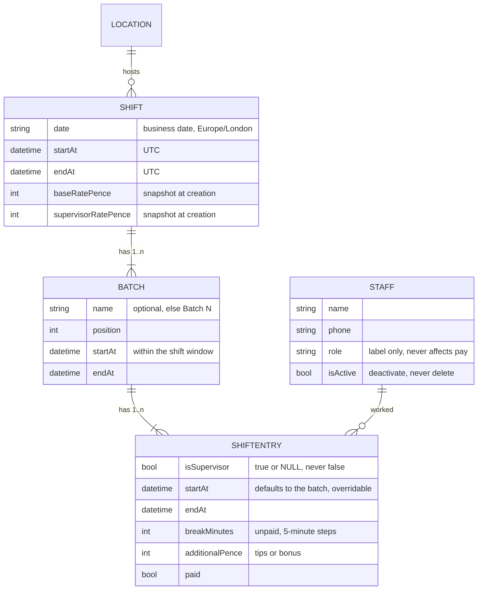
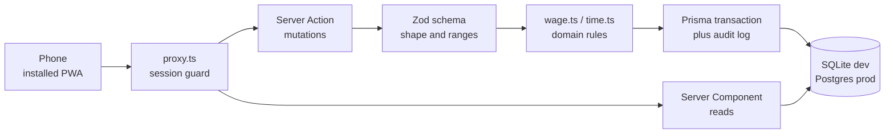

# Architecture

How Wage-Calc is put together, and why. The short version lives in the
[README](../README.md); this is the detail behind it.

---

## The domain model

The shape of the data is the most important decision in the project. A shift
at a large function does not have one start time — an early crew sets up at
12:00 while service staff arrive at 14:00. Modelling staff directly against a
shift forced the accountant to type times 25 times over. Introducing a
**batch** — a group who share start and finish times — collapses that to one
entry per group.



Rules the model enforces rather than trusts:

| Rule | How it is enforced |
|---|---|
| Exactly one supervisor per shift | Partial unique index on `(shiftId, isSupervisor)`. The column is `true` or `NULL` — never `false` — and SQL treats NULLs as distinct, so many crew rows coexist while a second supervisor is rejected by the database itself |
| A staff member appears once per shift | Unique index on `(shiftId, staffId)` |
| Nobody works outside the shift window | Validated server-side against the shift's own times; the error names the person and the batch |
| A staff member cannot be in two overlapping shifts | Overlap query before every write, naming the conflicting shift and venue |
| Staff with history are never deleted | Deactivated instead, so past payroll records stay intact |

## Request flow

Every mutation is a Server Action — validated, authorised and audited before
it reaches the database.



The client never computes a figure the server will not recompute.
`src/lib/wage.ts` is a pure module with no I/O, imported by *both* the live
total in the shift editor and the server action that persists the shift — so
the number the accountant watches while typing is produced by the same code
that writes the record.

## Money and time

Two areas where the obvious implementation quietly goes wrong.

**Money is integer pence, everywhere.** No floating point touches a wage.
Base pay divides with half-up rounding without ever leaving integers:

```ts
// minutes × rate ÷ 60, rounded half-up, in integer arithmetic
function divideRoundHalfUp(numerator: number, denominator: number): number {
  return Math.floor((numerator * 2 + denominator) / (denominator * 2));
}
```

Pounds exist only at the display boundary (`formatPence`) and at input
(`parsePoundsToPence`, which rejects anything that is not a clean amount).

**Timestamps are UTC; the accountant thinks in London wall-clock.** Shifts
routinely cross midnight, and twice a year the clocks move. `src/lib/time.ts`
converts between the two and resolves the ambiguity of a bare `01:00` on an
overnight shift by choosing the candidate nearest the shift's start — so a
finish at 02:00 lands on the next calendar day without anyone typing a date.
Pay follows elapsed real time, which is why a shift spanning the spring clock
change pays six hours for 23:00→05:00, not seven.

## Paid entries are immovable

Once wages are handed over, the record has to match what was actually paid.

- Marking paid is per staff member per shift, so one person can be settled
  while the rest of the shift is not.
- A paid entry's wage-affecting fields are locked. Editing requires
  deliberately reverting it to unpaid, which is itself audit-logged.
- A shift containing any paid entry cannot be deleted.
- Editing a shift preserves entry IDs for staff who remain on it, so audit
  records of payments continue to resolve.

## One codebase, two databases

Development runs on a SQLite file; production runs on Neon Postgres. Rather
than editing a provider by hand at deploy time — exactly the sort of step that
gets forgotten — the target is derived from `DATABASE_URL`:

- `src/lib/db.ts` picks the driver adapter from the URL scheme.
- `prisma.config.ts` picks **both** the schema and the migration history, so
  SQLite migrations can never be applied to Postgres.
- `scripts/prisma-generate.mjs` generates the provider-specific client for the
  target; every database script runs it first. The test suites pin SQLite
  explicitly, so they pass regardless of what `.env` points at.
- `prisma/production/schema.prisma` is **generated** from the dev schema by
  `npm run schema:prod`. A unit test fails if the committed copy drifts, and
  CI re-derives the Postgres migration and diffs it.

The schema deliberately avoids enums and JSON columns so one model file serves
both engines; those fields are strings validated by Zod at the boundary.

## Testing strategy

| Layer | Tool | What it covers |
|---|---|---|
| Domain | Vitest | The wage engine exhaustively — rounding at half-penny boundaries, the 15-minute grid, overnight spans, DST changes, breaks that consume the shift, supervisor rate selection. Plus overlap detection, including touching boundaries |
| Database | Vitest + throwaway SQLite | That the invariants above are genuinely enforced by the database: a second supervisor rejected, duplicate staff rejected, batches cascading on delete |
| Schema | Vitest | The generated Postgres schema still matches the development schema |
| End-to-end | Playwright, phone viewport | Auth guards, creating a shift with bulk-added staff, two batches on different times, the shift-window rejection, payments including double-payment protection, paid-entry locking and revert, PDF generation, staff lifecycle |

The E2E suite runs against its own database on a separate port, so it never
touches development or production data.

## Deliberate non-goals

- **No multi-tenancy.** One organisation, one account. Tenant scoping on every
  query would have bought nothing for the one person using it.
- **No tax or NI.** Gross pay only; deductions are handled downstream by the
  business's existing process.
- **No rota planning.** The app records what happened in order to pay people,
  not what is scheduled to happen.
- **No sensitive personal data.** Names and phone numbers only. NI numbers,
  addresses and ID documents were deliberately left out to keep the
  application off the highest tier of data-protection obligations.
